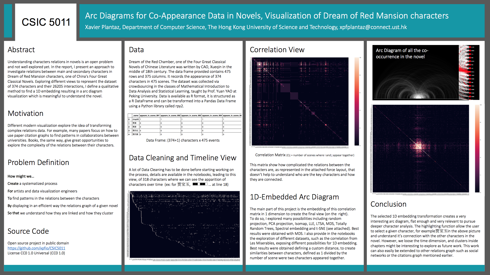
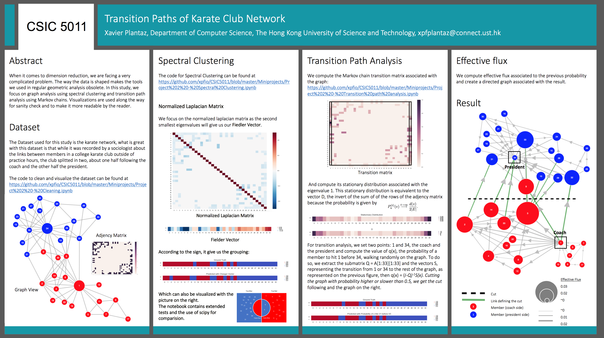

# CSIC5011
Topological and Geometric Data Reduction and Visualization Repo

# Overview

This repo contains the code source and the posters for Professor YAO course.

## Project 1

## Project 2

## Run Code

`jupyter notebook`

`python -m SimpleHTTPServer`

`python -m http.server`

## License

